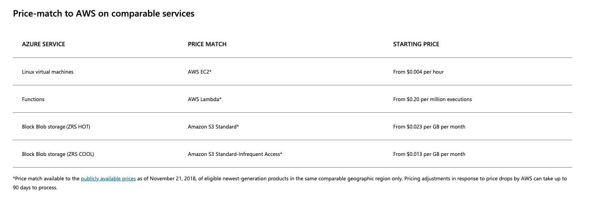
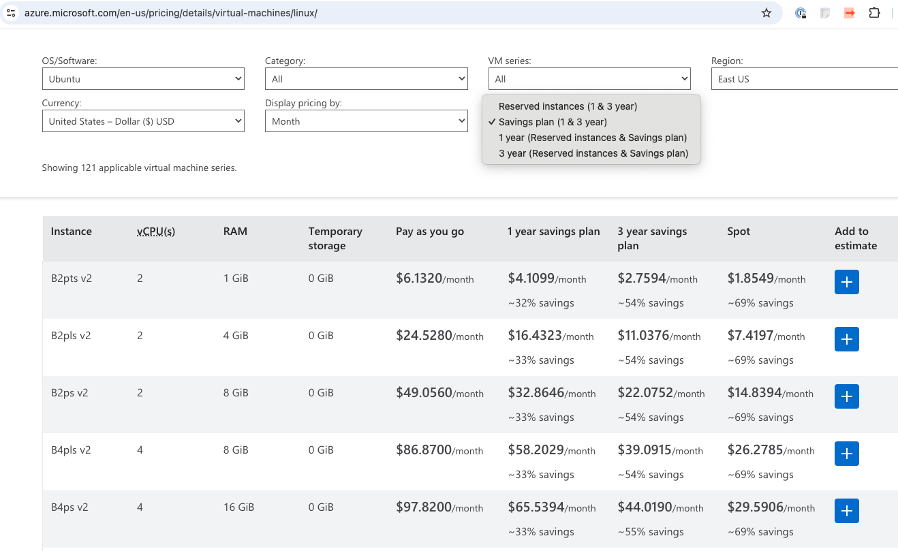
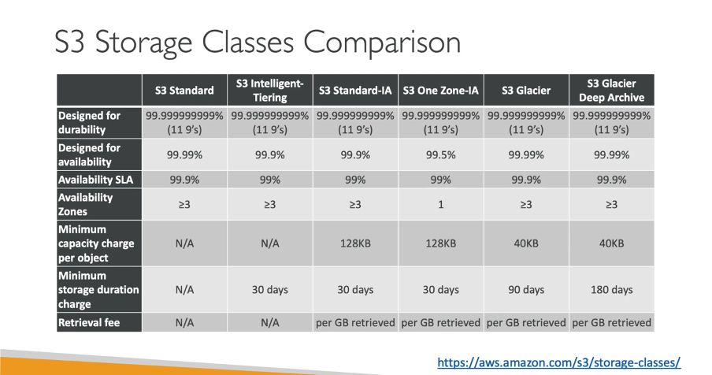
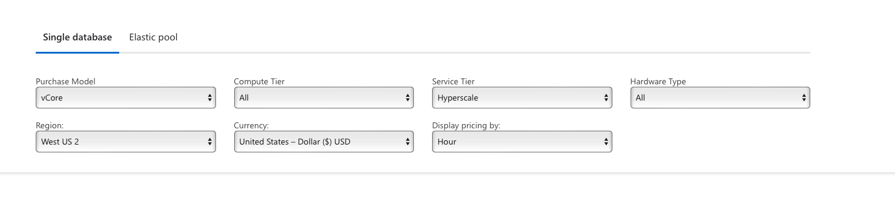
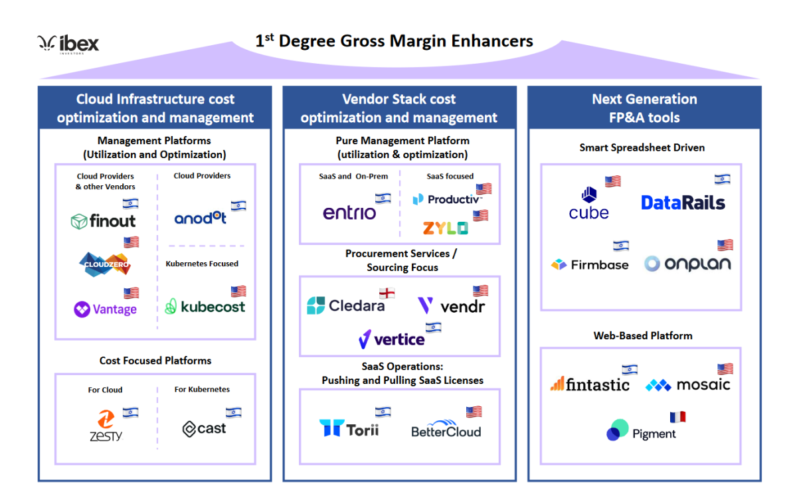
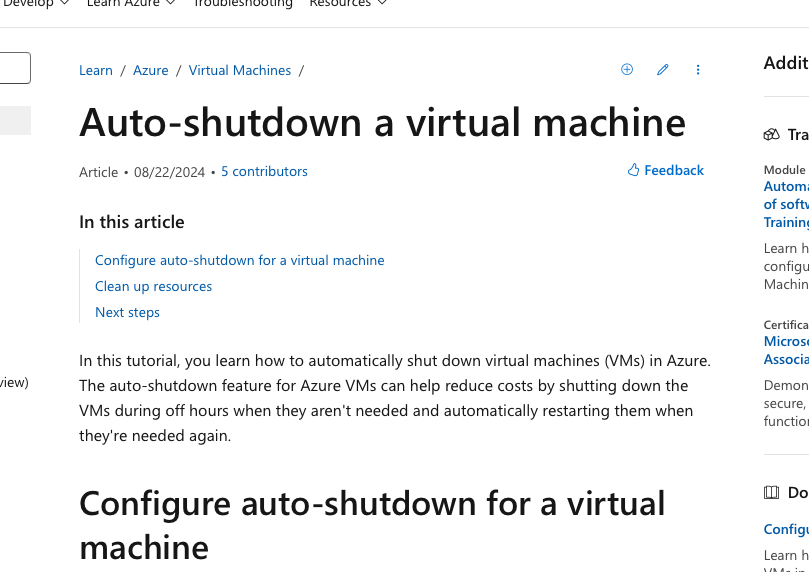

# Introduction to Cloud Pricing and Cost Management
Hants Williams, PhD, RN

---

# Overview of Topics

- **Introduction to Cloud Pricing Models**
  - PAYG, Reserved Instances, Spot/Preemptible, Savings Plans, Free Tier
- **Factors Influencing Cloud Costs**
  - Compute, Storage, Networking, Databases, Monitoring
- **Comparison of Major Cloud Providers**
  - AWS, Azure, GCP Pricing Models and Differences
- **Cost Management Best Practices**
  - Tagging, Monitoring, Rightsizing, Auto-scaling, FinOps

---

- **Cloud Cost Optimization Strategies**
  - Identifying Unused Resources, Reserved Instances, Spot Instances
- **Cost Management Tools**
  - AWS, Azure, GCP Cost Tools, Third-party Solutions
- **Cloud Billing Alerts and Budgeting**
  - Setting alerts, budget tools, forecasting costs
- **TCO and ROI Calculations**
  - Comparing cloud costs with on-premises, measuring ROI

---

# Introduction to Cloud Pricing Models

## Pay-as-you-go (PAYG)

- Billing based on actual usage of cloud resources. 
- Pay per hour, minute, or second of usage.

- **Advantages**:
  - Flexibility to scale resources.
  - No long-term commitment or upfront costs.
- **Disadvantages**:
  - Higher costs for sustained usage.
  - Harder to predict monthly expenses.

--- 

- **Use Cases**:
  - Development environments.
  - Applications with variable traffic.

- **Providers**: AWS, Azure, GCP.
    - **Example**: AWS EC2 instances billed per second.
    - **Example**: Azure Blob Storage billed per GB.
    - **Example**: GCP BigQuery billed per query.

---

## Azure Pay-as-you-go Pricing

https://azure.microsoft.com/en-us/pricing/purchase-options/pay-as-you-go/search 

---

## Reserved Instances

- Pre-purchased capacity for a specified term at a discount.
- Usually 1-3 year commitment for significant savings.

- **Advantages**:
  - Significant cost savings.
  - Predictable billing.
- **Disadvantages**:
  - Commitment to specific instance type.
  - Less flexibility to adapt.

---
- **Use Cases**:
  - Steady-state applications.
  - Long-term projects.
- **Providers**: AWS, Azure, GCP.
    - **Example**: AWS Reserved Instances for EC2.
    - **Example**: Azure Reserved VM Instances.
    - **Example**: GCP Committed Use Discounts.

---

## Spot/Preemptible Instances

- Excess capacity offered at discounted rates for short-term use.
- Can be terminated with short notice when reclaimed by provider.
- **Advantages**:
  - Up to 90% discounts.
  - Cost-effective for flexible applications.
- **Disadvantages**:
  - Not suitable for critical applications.

---
- **Use Cases**:
  - Batch processing, CI/CD pipelines.
  - Stateless web servers.
  - Fault-tolerant applications.
- **Providers**: AWS (Spot Instances), GCP (Preemptible VMs).
    - **Example**: AWS Spot Instances for EC2.
    - **Example**: GCP Preemptible VMs.

---
- GCP Preemptible VMs
- Source: 
     - https://cloud.google.com/compute/docs/instances/preemptible

---

## Savings Plans

- Flexible pricing with commitment to consistent usage.
- **Advantages**:
  - Flexibility compared to Reserved Instances.
  - Applies across various services.
- **Disadvantages**:
  - Requires commitment.
- **Use Cases**:
  - Predictable workloads with variance.

---

## Free Tier Services

- Limited free usage for new users.
- **Advantages**:
  - No-cost exploration of cloud services.
  - Ideal for learning or prototyping.
- **Disadvantages**:
  - Limited scope and duration.
- **Use Cases**:
  - Learning and small-scale projects.

---

# Factors Influencing Cloud Costs

---

## Compute Resources

- **Components**: VM types, CPU, memory, storage.
- **Cost Drivers**:
  - High-performance instances.
  - On-demand vs. reserved pricing.
- **Optimization**:
  - Select appropriate instance types.
  - Use serverless for event-driven apps.

---

--- 
- Azure VM Pricing
https://azure.microsoft.com/en-us/pricing/details/virtual-machines/windows/ 
https://azure.microsoft.com/en-us/pricing/details/virtual-machines/linux/ 

---

## Storage (Block, Object, Archival)

- **Types**:
  - Block Storage for high performance.
  - Object Storage for unstructured data.
  - Archival for low-cost, infrequent access.
- **Cost Drivers**:
  - Capacity, redundancy, access frequency.
- **Optimization**:
  - Choose storage class based on access patterns.
  - Implement lifecycle policies.

---

https://aws.amazon.com/s3/storage-classes/ 

---

## Networking (Data Transfer, IPs)

- **Components**: Data transfer, load balancing, IPs.
    - Data transfer: Ingress, egress, inter-region.
        - Ingress: Data coming into cloud.
        - Egress: Data going out of cloud.
    - Load balancing: Traffic distribution.
    - IPs: Static vs. dynamic.
- **Cost Drivers**:
  - Volume of data transfer.
- **Optimization**:
  - Minimize inter-region traffic.
  - Use CDNs for content delivery.

---

- Azure: 
    - https://azure.microsoft.com/en-us/pricing/details/bandwidth/
- Google:
    - https://cloud.google.com/vpc/network-pricing 

---

## Databases (Managed vs. Unmanaged)

- **Types**:
  - Managed (e.g., RDS, Cloud SQL).
  - Unmanaged (self-hosted).
- **Cost Drivers**:
  - Instance sizes, storage, backups.
- **Optimization**:
  - Right-size instances.
  - Choose managed for reduced ops overhead.

---

https://azure.microsoft.com/en-us/pricing/details/azure-sql-database/single/

---

## Monitoring and Analytics Tools

- **Services**: AWS CloudWatch, Azure Monitor.
- It costs money to monitor your cloud resources (ironic) - even this is a cost driver and service that needs to be optimized (monitoring the monitoring).
- **Cost Drivers**:
  - Log and metric volume.
  - Retention periods.
- **Optimization**:
  - Filter and aggregate logs.
  - Set efficient retention policies.

---

# Comparison of Major Cloud Providers

---

## AWS Pricing Overview

- **Services**: EC2, S3, RDS.
- **Pricing Models**: PAYG, Reserved Instances, Spot Instances.
- **Tools**: AWS Cost Explorer, Budgets.
- **Unique Offerings**:
  - Free Tier for 12 months.
  - Wide range of services.

---

## Azure Pricing Overview

- **Services**: VMs, Blob Storage, Azure SQL.
- **Pricing Models**: PAYG, Reserved VM Instances.
- **Tools**: Azure Cost Management, Budgets.
- **Unique Offerings**:
  - Azure Free Account with credits.
  - Microsoft product integration.

---

## GCP Pricing Overview

- **Services**: Compute Engine, Cloud Storage, Cloud SQL.
- **Pricing Models**: PAYG, Committed Use.
- **Tools**: GCP Pricing Calculator, Billing Console.
- **Unique Offerings**:
  - Free Tier with always free products.
  - Sustained use discounts.

---

## Key Differences Between Providers

- **Pricing Models**:
  - All are pretty similar, AWS is the most flexible and flexible.
- **Service Availability**:
  - AWS: largest global infrastructure.
  - Azure: deep Microsoft integration.
  - GCP: strength in analytics/ML.

---

# Cost Management Best Practices

---

## Tagging and Resource Labeling

- **Purpose**: Organize resources for cost allocation.
- **Best Practices**:
  - Implement consistent tagging.
  - Use for environments, projects, departments.
- **Benefits**: Improved cost visibility and reporting.

---

### Example of Tagging
- **Tags**: Environment, Department, Project.
- **Example**: `Environment: Production`, `Department: Marketing`, `Project: App1`.
- **Use Cases**: Cost allocation, resource grouping.
- **Benefits**: Granular cost tracking, resource management - easy for billing and tracking.

---

## Monitoring and Alerts for Billing

- **Tools**: AWS Budgets, Azure Cost Management.
- **Best Practices**:
  - Set up budget alerts.
  - Regularly monitor usage patterns.
- **Benefits**: Avoid surprise bills, ensure accountability.

---

## Rightsizing Resources

- **Definition**: Adjust resource sizes to match usage.
- **Best Practices**:
  - Analyze utilization metrics.
  - Use tools to recommend instance sizes.
- **Benefits**: Eliminate waste, improve efficiency.

---

## Auto-scaling and Elasticity

- **Definition**: Automatically scale resources based on demand.
- **Best Practices**:
  - Set up autoscaling policies.
  - Use serverless architectures where possible.
- **Benefits**: Cost savings, improved performance.

---

## Cloud Financial Operations (FinOps)

- **Definition**: Managing cloud financials to maximize value.
- **Best Practices**:
  - Cross-functional collaboration (finance, ops, engineering).
  - Regular reviews of cloud spending.
- **Benefits**: Aligns costs with business goals.

---

---

## Third-party Tools (CloudHealth, Cloudability)

- **Features**: Multi-cloud cost management.
- **Benefits**:
  - Unified view across clouds.
  - Advanced reporting and policy enforcement.

---

# Cloud Cost Optimization Strategies

---

## Identifying Unused/Underutilized Resources

- **Techniques**:
  - Regular audits for idle instances.
  - Use provider tools for resource discovery.
- **Best Practices**:
  - Terminate unused resources.
  - Reallocate underutilized resources.

---

## Leveraging Reserved Instances/Savings Plans

- **Approach**: Commit to long-term usage.
- **Best Practices**:
  - Analyze historical usage.
  - Ensure commitments align with future needs.

---

## Using Spot/Preemptible Instances

- **Approach**: Use for non-critical workloads.
- **Best Practices**:
  - Implement fault-tolerant designs.
  - Balance with regular instances for reliability.

---

## Optimizing Data Storage (Cold vs. Hot Storage)

- **Definition**:
  - **Hot**: High-performance, frequent access.
  - **Cold**: Low-cost, infrequent access.
- **Best Practices**:
  - Use lifecycle policies.
  - Classify data based on access frequency.

---

## Scheduling Non-essential Services

- **Approach**: Start/stop resources based on schedule.
- **Best Practices**:
  - Automate service shutdowns during off-hours.
  - Identify non-critical services for pausing.

---

Azure VM Autoshutdown: https://learn.microsoft.com/en-us/azure/virtual-machines/auto-shutdown-vm?tabs=portal

---

# Cost Management Tools

---

## AWS Cost Explorer

- **Features**: Analyze spending, create reports, forecast costs.
- **Best Practices**:
  - Use filtering to drill into specific costs.
  - Schedule regular reports.

---

## Azure Cost Management + Billing

- **Features**: Track spending, analyze trends, set budgets.
- **Best Practices**:
  - Implement tags for resource allocation.
  - Set budget alerts for cost control.

---

## GCP Pricing Calculator/Billing Console

- **Features**: Estimate costs, monitor spending.
- **Best Practices**:
  - Use billing reports to identify cost drivers.
  - Set alerts for budget thresholds.

---

# Cloud Billing Alerts and Budgeting

---

## Setting Up Alerts for Cost Thresholds

- **Best Practices**:
  - Define budget limits.
  - Set alerts for 80%, 100%, 120% thresholds.

---

## Budgeting Tools

- **AWS**: AWS Budgets, Cost Explorer.
- **Azure**: Azure Budgets, Advisor.
- **GCP**: GCP Budget Alerts, Billing Reports.

---

## Forecasting Future Cloud Costs

- **Techniques**: Historical data, usage trends.
- **Best Practices**:
  - Use native forecasting tools.
  - Adjust based on workload projections.

---

# Total Cost of Ownership (TCO) and ROI

---

## TCO Calculation

- **Definition**: Total costs over service lifecycle.
- **Components**:
  - Direct (compute, storage) and indirect (ops, maintenance).
- **Comparison**: Cloud vs. on-premises infrastructure.

---

## ROI Calculation

- **Definition**: Financial benefits relative to costs.
- **Formula**: ROI = (Net Benefits / Total Costs) * 100%.
- **Best Practices**: Regular TCO/ROI reviews.

---

# Conclusion

---

## Ongoing Cost Monitoring

- **Reasons**:
  - Dynamic environments require continuous monitoring.
- **Best Practices**:
  - Implement automated reports and alerts.
  - Regular reviews of budgets and cost-saving measures.

---

## Benefits of Optimizing Cloud Costs

- **Short-term Impact**:
  - Immediate cost savings.
  - Improved cost visibility.

- **Advantages**:
  - Reduced operational costs.
  - Improved resource utilization.
- **Long-term Impact**: Frees up budget for strategic investments.

---

## Leave you with...

As you go into your organization and promote cloud cost optimization, remember the key strategies:

- **Cost Governance**: Establish policies for resource usage.
- **FinOps Culture**: Foster collaboration between teams.
- **Automation**: Use auto-scaling, scheduling, and optimization tools.
- **Education**: Train teams on cloud pricing and management.

---

