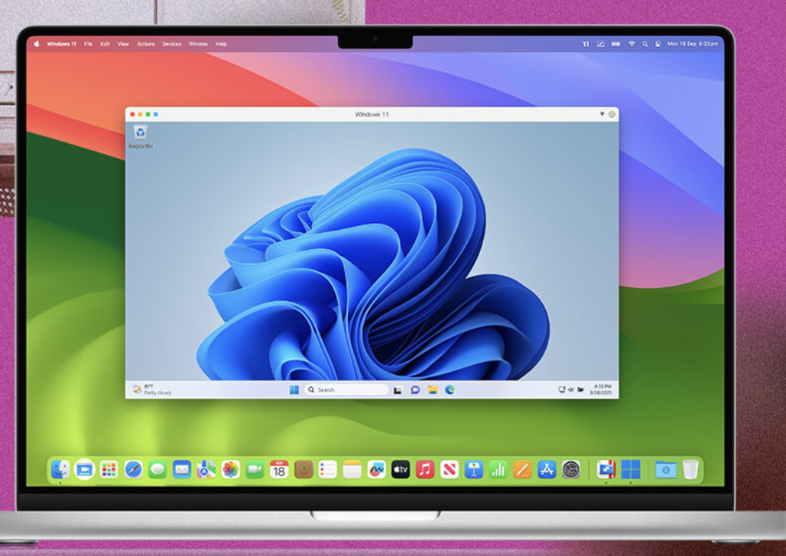

# Introduction to Cloud Compute
Hants Williams, PhD, RN

---

# What is a virtual machine?

- A virtual machine (VM) is a virtual representation or emulation of a physical computer that uses software instead of hardware to run programs and deploy applications.

---

# A computer within a computer


---

# What is a virtual machine?

- Virtual Machines (VMs) allow businesses to run multiple virtual machines with different operating systems on a single physical machine by utilizing its resources (CPU, RAM, storage (harddrive), networking).
- VMs are known as "guests," running on a physical "host" machine. 
- Cloud providers are integrating VMs and technologies like containers to offer scalable, flexible, and cost-efficient IT infrastructure.

---


---

# Background on virtualization and VMs

- Virtual Machines (VMs) are powered by virtualization, which creates software-based versions of mainly compute, storage, networking 
- Virtualization enhances the efficiency of physical computer hardware and is fundamental to cloud computing.
- A hypervisor, or virtual machine monitor (VMM), is the lightweight software managing VMs as they run concurrently.

---

# Background continued... 

- Virtualization originated in 1964 with IBM’s CP-40 project, which evolved into CP-67 and Unix, supporting multiple users and leading to modern VMs.
- On August 2, 1972, IBM introduced the VM/370 and System/370 mainframes, the first to support virtual memory.
- In 1998, VMware developed the x86 OS, allowing multiple VMs on a single machine, and released VM Workstation 1.0 in 1999, enabling users to run multiple OSes as VMs on a single PC.
- Today, virtualization is integral to enterprise IT infrastructure, supporting cost efficiency and scalability by virtualizing all types of IT resources, from desktops to data centers.

---


---

# How do virtual machines work?

- Virtualization relies on hypervisor technology, a software layer that separates the operating system and applications from the physical hardware of a computer or server (bare metal).

- Hypervisors:
    - manage shared resources (memory, RAM, storage) and allow virtual machines (VMs) to run independently while sharing the physical hardware. They allocate resources and ensure VMs don’t interfere with one another.

---

**Types of Hypervisors:**

1. **Type 1 Hypervisors**:  
   - Run directly on physical hardware, replacing the operating system.  
   - Used primarily on servers.  
   - Separate software is required to create and manage VMs.  
   - Examples: VMware’s vSphere, Kernel-based Virtual Machine (KVM).

---


---

**Types of Hypervisors:**

2. **Type 2 Hypervisors**:  
   - Run as an application within a host OS, targeting single-user desktop or notebook platforms.  
   - VMs are created manually, with users installing a guest OS inside them.  
   - Resources (processor cores, memory, etc.) can be manually allocated to each VM.  
   
---

## Type 2: Parallels Desktop (Mac), or VMware Workstation/Fusion for Windows/Linux/Mac
- Parallels Desktop: https://www.parallels.com/ 
- Oracle VirtualBox

---



--- 


---

## Advantages of Virtual Machines

- **Resource Utilization and Improved ROI**:  
  Multiple VMs on a single physical machine maximize hardware utilization, reducing the need for additional servers and lowering IT costs.

- **Agility and Speed**:  
  VMs are software-based, allowing for quick setup and scaling to meet new workload demands compared to physical hardware provisioning.

- **Portability**:  
  VMs can be easily relocated between physical computers or moved between on-premises and cloud environments, supporting hybrid cloud scenarios.

---

## Advantages of Virtual Machines Continued...

- **Flexibility**:  
  VMs are quicker to create than installing a new OS on physical hardware. They can be cloned, providing rapid deployment of new environments for development and testing.

- **Security**:  
  VMs offer enhanced security features, including snapshots for quick recovery from malware infections and the ability to scan VM files for threats.

- **Sustainability**:  
  By reducing the number of physical servers needed, VMs help lower energy consumption, improving environmental sustainability.

---

## Disadvantages of Virtual Machines

- **Performance Issues**:  
  VMs rely on the host computer's hardware resources. If resources are limited, it can result in reduced performance and inefficiencies.

- **Increased Complexity**:  
  Configuring and managing VMs can be complex, requiring specialized technical expertise for setup and maintenance.

- **Single Point of Failure (SPOF)**:  
  Since VMs rely on a single physical machine, they are vulnerable to a single point of failure if the host computer experiences issues.

---

## Top Virtual Machine Use Cases

- **Enabling Cloud-Based Computing**:  
  VMs are the backbone of cloud computing, allowing multiple applications and workloads to run and scale efficiently.

- **Speeding Workload Migration**:  
  VMs' portability makes them ideal for migrating workloads from on-premises to cloud environments.

- **Accelerating Hybrid Cloud Journeys**:  
  VMs provide the infrastructure for hybrid cloud environments that integrate on-premises, private, and public clouds into a unified IT infrastructure.

---

- **Supporting DevOps**:  
  VMs enable DevOps teams to create templates for software development and testing processes, streamlining automated workflows and testing environments.

- **Testing a New Operating System**:  
  VMs allow users to test a new OS without impacting their primary operating system.

- **Investigating Malware**:  
  Researchers can use VMs to test malicious programs in isolated environments.

---

- **Running Incompatible Software**:  
  VMs enable users to run software that is only compatible with a different operating system.

- **Browsing Securely**:  
  VMs can be used for secure browsing, where snapshots can be taken and restored after each session, mitigating the risk of infections.

- **Supporting Disaster Recovery (DR)**:  
  VMs allow quick provisioning and replication, significantly speeding up disaster recovery efforts compared to setting up new physical servers.

---

## Common Types of Virtual Machines

- **Windows Virtual Machines**:  
  Hyper-V is Microsoft’s hypervisor included in Windows, creating a parent partition for itself and the primary OS, while other OSes run in child partitions. Windows VMs are widely supported by most hypervisors.

- **Android Virtual Machines**:  
  Android, typically running on ARM processors, can be virtualized on x86 architecture using projects like Shashlik or Genymotion. Android-x86 or Anbox can also be used to run Android on x86 machines.

- **Mac Virtual Machines**:  
  Apple only allows macOS to run on Apple hardware, but Type 2 hypervisors can create macOS VMs on Apple hardware.

---

## Common Types of Virtual Machines continued...

- **iOS Virtual Machines**:  
  iOS cannot be virtualized, but Apple provides an iPhone simulator through Xcode for development purposes.

- **Java Virtual Machines (JVMs)**:  
  JVMs execute Java programs by translating bytecode into machine code specific to the host system’s hardware. JVMs differ from traditional VMs as they do not use hypervisors or run entire OSes.

- **Python Virtual Machines**:  
  Similar to JVM, Python VM translates Python programs into bytecode and then into machine code for execution, without using a hypervisor or guest OS.

---

## Common Types of Virtual Machines continued...

- **Linux Virtual Machines**:  
  Linux is commonly used as both a guest and host OS. Its native hypervisor, Kernel-based Virtual Machine (KVM), is owned by Red Hat and is widely used in open-source environments.

- **Ubuntu Virtual Machines**:  
  Ubuntu, a popular Linux distribution, is available for both desktop and server environments and can be used as a guest OS on Hyper-V with enhanced session features, such as clipboard integration and shared folders.

- **VMware Virtual Machines**:  
  VMware is a leader in virtualization, providing both Type 1 and Type 2 hypervisors and VM software for enterprise customers. It was the first to commercialize x86 architecture virtualization.

---

# Multi-tenant vs. Single-tenant Virtual Machines

- **Multi-tenant Virtual Machines**:  
  - In a multi-tenant model, multiple users share a common physical infrastructure, making it the most cost-effective and scalable option for provisioning VMs.
  - However, it lacks the isolation required by organizations with strict security or compliance needs (HIPAA, GDPR, HITRUST, etc.).
---


---

- **Single-tenant Virtual Machines**:  
  Single-tenant VMs offer enhanced isolation, typically through two models: dedicated hosts and dedicated instances.

  - **Dedicated Host**:  
    Involves renting an entire physical machine, providing full control over hardware, workload placement, and flexibility. Ideal for organizations with specific hardware or software licensing needs.
  
  - **Dedicated Instance**:  
    Offers single-tenant isolation but is not tied to a specific physical machine. Upon reboot, the instance may be placed on a new machine dedicated to the same account, potentially in a different location.

---


---


---

# Pricing Models for Virtual Machines

- **Pay-as-you-go**:  
  Users pay based on their actual usage with no upfront costs, typically charged by the hour or second depending on the provider and VM instance type.

- **Transient/Spot Instances**:  
  This is the lowest-cost model where users leverage a provider's excess capacity. These instances can be reclaimed at any time, making them suitable for non-critical applications.

- **Reserved Instances**:  
  Customers commit to a term (usually 1-3 years) in exchange for significant discounts compared to pay-as-you-go pricing.

---

- **Dedicated Hosts**:  
  Users pay for the entire cost of a physical server, typically billed hourly or monthly. This model offers full control over hardware.

---

# Virtual Machines vs. Bare Metal Servers

- **Bare Metal Servers**:  
  - Single-tenant physical servers with no virtualization software (hypervisor).
  - Prioritize raw hardware, power, and isolation, making them ideal for performance-heavy and security-focused workloads.
  - Suitable for long-term, data-intensive applications or those with strict regulatory compliance, such as ERP, CRM, SCM, e-commerce, and financial services.

---

- **Virtual Machines**:  
  - Use a hypervisor on bare metal hardware to maximize flexibility and scalability.
  - Increase server capacity and utilization, making them ideal for dynamic workloads, resizing datasets, and moving data between VMs.
  - Best suited for scenarios requiring adaptability and workload management.

---

# Creating and Connecting to Virtual Machines on GCP

- **Creating a Virtual Machine**:  
  - Log in to the Google Cloud Platform (GCP) Console.
  - Click on the "Navigation menu" > "Compute Engine" > "VM instances."
  - Click "Create" to configure your VM instance, selecting the region, machine type, boot disk, and other settings.

---

- **Creating a Virtual Machine**:  
    -  Special settings to be aware of: 
        - Firwall: allow HTTP/HTTPS traffic 
    - Click "Create" to deploy your VM instance.

---


---


---


---

- **Connecting to a Virtual Machine via Cloud Console**:  
  - Click on the "SSH" button next to your VM instance in the GCP Console.
  - Use the Cloud Console, gcloud command-line tool, or SSH client to connect to your VM instance.

---

- **Creating new users**:  
  - Use the `sudo adduser` command to create new users on your VM instance.
  - As a example, `sudo adduser newusername`.
    - Example: `sudo adduser hants`.
  - (If you want) Then give the new user sudo privileges with `sudo usermod -aG sudo newuser`.
    - Example: `sudo usermod -aG sudo hants`.

---

  - Enable login with password: 
    - Allow password authentication in `/etc/ssh/sshd_config` file.
        - Example: `sudo nano /etc/ssh/sshd_config` 
    - Modify: 
        ```bash
        PasswordAuthentication yes
        PermitRootLogin no
        ```
    - Save and exit the file.
    - Then restart the ssh service: `sudo systemctl restart sshd`.

---

- Then connecting with ssh in some type of terminal:
    - First make sure that ssh is installed on your machine.
        - Example: `ssh -V`
          - If you are on a mac, it should be installed by default.
          - If you are on a pc, use Windows Powershell or Windows Linux Subsystem.
    - `ssh newusername@ipaddress`
    - Example: `ssh hants@XXX.XXX.XX` 

---

# What you would then do?
- Update host machine: `sudo apt update` 
- Install some software, like python: `sudo apt install python3`
- Install some software, like git: `sudo apt install git`

---

# Conclusion, what comes next?

- Deploying some software (python) on the VM.
- Managing the networking and security of the VM to allow for external access.
- Perhaps associating a domain name with the VM.
- Share the VM with other users.

--- 